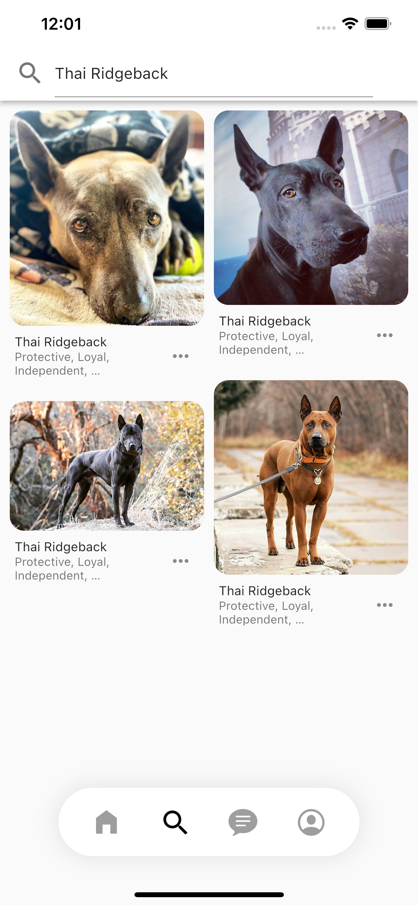

# Hi, I'm Nasibullo Nabiev

* I built this application using Flutter and integrated The Dog API to display a vast collection of dog breeds with detailed information. The app allows users to:
* Browse different dog breeds with images and descriptions
* Search for specific breeds
* Save favorite dogs
* Vote on dogs
* Upload images

I developed this program to learn Flutter and Internet connection.

## 😃 Author
**Nabiev Nasibullo** 

## Application for searching and downloading pictures of cute puppies

# ScreenShots

# Search Page

# Favorite Page

# Upload Page

# That's it for now!

